# VyaparMind AI — Autonomous Revenue Growth & Agentic Commerce Platform

[](https://opensource.org/licenses/MIT)
[](https://razorpay.com)
[](https://nextjs.org/)
[](https://murf.ai/api/docs/text-to-speech/streaming)
[](https://docs.livekit.io)
[](https://www.python.org/)

> **"VyaparMind turns customer intent into measurable, verified revenue by allowing AI agents to discover customer needs, recommend products, increase basket value, recover abandoned purchases, and safely execute commerce through Razorpay."**

---

##  Executive Summary & Proposition

VyaparMind AI is an enterprise-grade **Autonomous Revenue Growth and Agentic Commerce Platform** built for the **Razorpay Student AI Builder Buildathon (AI Growth / Agentic Commerce Track)**. 

Unlike traditional chatbots that simply answer FAQs, VyaparMind AI orchestrates a multi-agent system that autonomously drives the complete commerce loop:
$$\text{Understand Intent} \longrightarrow \text{Verify Catalog} \longrightarrow \text{Recommend \& Upsell} \longrightarrow \text{Policy Safety Gate} \longrightarrow \text{Razorpay Checkout} \longrightarrow \text{Server-Side HMAC Verification} \longrightarrow \text{Webhook Idempotency} \longrightarrow \text{Order Paid} \longrightarrow \text{Revenue Attribution} \longrightarrow \text{Audit Trail}$$

---

## key Capabilities

1. **AI Buyer & Merchant Growth Agent Fleet**:
   - **Merchant Growth Agent**: Detects high-intent purchase leads, ranks catalog items, offers contextual cross-sells, and calculates revenue impact.
   - **AI Buyer Agent**: Understands buyer specifications, searches structured catalogs, verifies inventory, confirms totals, and orchestrates policy-gated Razorpay checkouts.
   - **Revenue Recovery Specialist**: Detects abandoned inquiries and checkout drop-offs, executing autonomous recovery campaigns with personalized coupons.
   - **Support & Inventory Analysts**: Resolves order queries and detects stock demand spikes in real time.
2. **Real Razorpay Test Mode Gateway**:
   - Server-side order creation (`/api/razorpay/order`) with server-calculated prices (zero client-side price tampering).
   - Standard Razorpay Checkout integration with test cards and UPI.
   - Server-side payment verification (`/api/razorpay/verify`) with HMAC SHA-256 signatures (`RAZORPAY_KEY_SECRET`).
   - Webhook processor (`/api/razorpay/webhook`) with signature verification and in-memory event deduplication / idempotency cache.
3. **Agent Action Policy Engine**:
   - Centralized boundary enforcement: `MAX_AGENT_PAYMENT = ₹25,000`, `MAX_DISCOUNT = 15%`, `MAX_PAYMENT_RETRIES = 2`.
   - Real-time risk scoring (`LOW`, `MEDIUM`, `HIGH`) and mandatory approval gating for high-risk actions.
4. **Zero-Hallucination Guardrails**:
   - Real-time verification tags: `✓ Product Verified`, `✓ Price Verified`, `✓ Inventory Verified`, `✓ Policy Approved`.
   - Complete refusal of out-of-catalog items (e.g. groceries, coding queries).
5. **Multi-Agent Revenue Attribution Engine**:
   - Transparent separation between **AI Direct Revenue**, **AI Influenced Revenue**, **Recovered Revenue**, and **Upsell / Cross-Sell Revenue**.
   - Clear dataset distinction between *Simulated Demo Data* and *Razorpay Test Transactions*.
6. **Interactive 14-Step Judge Demo Mode**:
   - Guided 3-to-5 minute interactive walkthrough covering the complete agentic commerce lifecycle and payment failure recovery.

---

## Technical Architecture

```mermaid
flowchart TD
    subgraph UI ["VyaparMind Growth OS (Next.js 15 Frontend)"]
        Dashboard["Executive Overview & AI Revenue Command Center"]
        Catalogue["Structured AI-Readable Catalogue (24 Verified SKUs)"]
        OppCenter["Opportunity Center (Intent & Cart Recovery)"]
        CustIntel["Customer Intelligence Hub (Memory & Preferences)"]
        FleetControl["AI Agent Control Center (Multi-Agent Fleet)"]
        CopilotModal["AI Commerce Copilot (Murf Falcon Voice + Text)"]
        JudgeDemo["14-Step Judge Demo Mode (Guided Walkthrough)"]
        AuditView["Agent Activity / Audit Trail (Live Timeline)"]
    end

    subgraph CoreEngine ["Agentic Commerce & Policy Services"]
        IntentEngine["Intent Classification & Budget Extractor"]
        CatalogService["Catalog Verification & Cross-Sell Service"]
        PolicyEngine["Agent Action Policy Engine (Bound: ₹25k, Risk Gating)"]
        StateMachine["Order State Machine (DISCOVERED -> PAID)"]
        AttributionService["Revenue Attribution Engine (Direct vs Influenced)"]
        AuditService["Audit Trail & Event Logger"]
    end

    subgraph RazorpayCore ["Razorpay Test Mode Integration"]
        OrderRoute["POST /api/razorpay/order (Server-Side Price Calculation)"]
        VerifyRoute["POST /api/razorpay/verify (HMAC SHA-256 Verification)"]
        WebhookRoute["POST /api/razorpay/webhook (Signature + Idempotency)"]
        CheckoutSDK["Razorpay Standard Checkout Modal"]
    end

    CopilotModal --> IntentEngine
    IntentEngine --> CatalogService
    CatalogService --> PolicyEngine
    PolicyEngine -->|Gated Action Preview| CopilotModal
    CopilotModal --> OrderRoute
    OrderRoute --> CheckoutSDK
    CheckoutSDK --> VerifyRoute
    WebhookRoute --> StateMachine
    StateMachine --> AttributionService
    StateMachine --> AuditService
    AttributionService --> Dashboard
    AuditService --> AuditView
```



---

## Razorpay Test Mode & Commerce Flow

```
Customer Input (Hinglish/English/Hindi)
  ↓
Intent Detection (Category: Smartphones, Budget: ₹15k, Confidence: 96%)
  ↓
Catalog Verification (Redmi Note 13 Pro 5G, PROD-101, ₹14,999, In Stock)
  ↓
Contextual Cross-Sell (67W Fast Charger Combo +₹499)
  ↓
Customer Affirmation (Explicit consent recorded)
  ↓
Action Policy Engine (Bound Check <= ₹25k, Discount <= 15%, Risk: LOW)
  ↓
Server-Side Order API (`/api/razorpay/order`)
  ↓
Razorpay Test Checkout Modal (Standard Razorpay Interface)
  ↓
Payment Authorized (`pay_test_...`)
  ↓
Server-Side Verification (`/api/razorpay/verify` via HMAC SHA-256)
  ↓
Webhook Processing (`/api/razorpay/webhook` with Idempotency Cache)
  ↓
Order Marked PAID (Order State Machine)
  ↓
Revenue Attribution (+₹15,498 AI Direct Revenue)
  ↓
Audit Trail Event Logged & Executive Overview Synchronized
```

---

## Security & Policy Model

| Security Layer | Implementation | Protection |
| --- | --- | --- |
| **Server-Side Pricing** | Computed exclusively on backend from verified catalog | Prevents client-side price tampering |
| **HMAC SHA-256 Signatures** | `crypto.createHmac('sha256', RAZORPAY_KEY_SECRET)` | Prevents payment token spoofing |
| **Webhook Idempotency** | In-memory event deduplication cache | Eliminates double-charging & replay attacks |
| **Action Policy Engine** | ₹25,000 transaction bound, 15% discount limit, 2 retries | Restricts autonomous agent financial limits |
| **Secret Isolation** | Key secret kept strictly in server env variables | Zero client-side credential exposure |
| **Zero-Hallucination** | Real-time catalog & spec validation | Prevents hallucinated products or inventory |

---

## 5-Minute Hackathon Demo Script

1. **Step 1 — Open Executive Overview (`0:00 - 0:45`)**:
   - Showcase **AI Revenue Command Center** metrics (*Gross Revenue*, *AI Direct Revenue*, *Recovered Revenue*, *Razorpay Test Volume*).
   - Point out transparent dataset separation between *Demo Baseline* and *Razorpay Test Transactions*.
2. **Step 2 — Launch Judge Demo (`0:45 - 2:30`)**:
   - Click **"JUDGE DEMO"** in the header.
   - Walk through the 14-step automated story: Hinglish intent extraction → catalog check → cross-sell add-on → customer consent → policy check → Razorpay order → checkout → server verification → webhook idempotency → order paid → revenue attribution.
3. **Step 3 — Test Payment Failure Recovery (`2:30 - 3:30`)**:
   - Toggle **"Payment Failure Recovery"** mode in Judge Demo.
   - Demonstrate how the system detects payment failure, safely avoids marking the order paid, enforces the retry limit (1/2), and triggers an automated recovery opportunity in the Opportunity Center.
4. **Step 4 — Live AI Copilot & Voice Session (`3:30 - 4:15`)**:
   - Open **AI Copilot Room**.
   - Trigger *"Show me the best 5G phone under ₹15k"*.
   - Experience low-latency voice synthesis, zero-hallucination badges, and 1-click Razorpay Test payment.
5. **Step 5 — Agent Control Center & Audit Trail (`4:15 - 5:00`)**:
   - View the active Multi-Agent Fleet (*Merchant Growth Agent*, *AI Buyer Agent*, *Recovery Specialist*).
   - Inspect the **Agent Activity / Audit Trail** with 100% auditable timeline records and JSON export capability.

---

## 1-Minute Elevator Pitch

> *"E-commerce businesses lose billions every year from unassisted inquiries, abandoned checkouts, and missed cross-sells. Traditional chatbots are passive FAQ responders that cannot execute transactions safely.*
>
> *VyaparMind AI is an Autonomous Revenue Growth & Agentic Commerce Platform that turns customer intent into verified revenue. Our multi-agent fleet discovers buyer needs in natural Hinglish, verifies live merchant catalogs, bundles accessories to lift basket value, and safely executes policy-gated checkouts via Razorpay.*
>
> *With zero-hallucination guardrails, server-side HMAC verification, idempotent webhooks, and granular revenue attribution, VyaparMind AI transforms AI from a cost center into a 24/7 autonomous revenue engine."*

---

## Quickstart & Local Setup

### Prerequisites

- **Node.js**: v18 or higher
- **pnpm**: `npm install -g pnpm`
- **Python**: 3.10 to 3.14
- **uv**: Python installer (`pip install uv`)

### 1. Environment Setup

```bash
# Frontend environment
cp frontend/.env.example frontend/.env.local

# Backend environment
cp backend/.env.example backend/.env.local
```

Fill in your credentials in `frontend/.env.local`:
```env
NEXT_PUBLIC_RAZORPAY_KEY_ID=rzp_test_your_key_id
RAZORPAY_KEY_ID=rzp_test_your_key_id
RAZORPAY_KEY_SECRET=your_razorpay_key_secret
RAZORPAY_WEBHOOK_SECRET=your_razorpay_webhook_secret
```

*(Note: If Razorpay keys are not provided, VyaparMind AI seamlessly runs in emulated test mode so judges can test without setup barriers.)*

### 2. Launch Local Servers

#### Windows (PowerShell):
```powershell
.\start_app.ps1
```

#### macOS / Linux (Bash):
```bash
chmod +x start_app.sh
./start_app.sh
```

- **Frontend Dashboard**: `http://localhost:3000`
- **Backend Voice Agent**: Autonomous LiveKit Worker listening for WebRTC sessions

### 3. Run Automated Tests

```bash
cd frontend
pnpm dlx tsx tests/agentic-commerce.test.ts
```

---

## Vercel Deployment

1. Import repository to [Vercel](https://vercel.com).
2. Set root directory to `frontend`.
3. Add Environment Variables:
   - `NEXT_PUBLIC_RAZORPAY_KEY_ID`
   - `RAZORPAY_KEY_ID`
   - `RAZORPAY_KEY_SECRET`
   - `RAZORPAY_WEBHOOK_SECRET`
4. Deploy!

---

## Hackathon Track Alignment

| Requirement | VyaparMind AI Implementation |
| --- | --- |
| **AI Growth / Agentic Commerce** | Autonomous AI Buyer & Merchant Growth Agents executing revenue-generating checkouts |
| **Razorpay Integration** | Server-side test order creation, standard checkout modal, HMAC-SHA256 signature verification |
| **Webhook Reliability** | Webhook signature verification, idempotency caching, and event deduplication |
| **Safety & Policy** | Centralized policy bounds (₹25k limit, 15% discount cap), risk scoring, and human approval gates |
| **Zero-Hallucination** | Real-time catalog & inventory verification; complete refusal of unauthorized queries |
| **Revenue Attribution** | Distinct tracking for AI Direct, Influenced, Recovered, and Upsell revenue |
| **Judge Experience** | Interactive 14-step guided Judge Demo walkthrough and failure recovery proof |

Live Link:https://vyaparmind-app.vercel.app/

