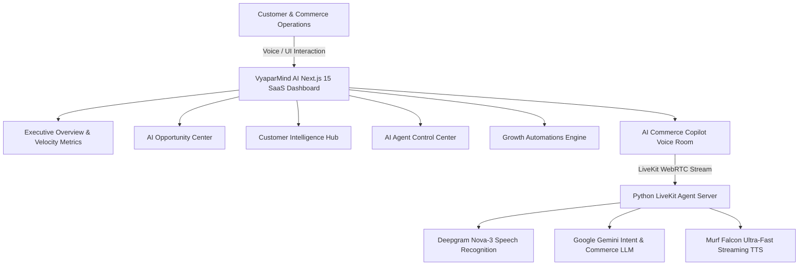

# VyaparMind AI — Autonomous Commerce & Growth Intelligence Platform

[](https://opensource.org/licenses/MIT)
[](https://murf.ai/api/docs/text-to-speech/streaming)
[](https://docs.livekit.io)
[](https://nextjs.org/)
[](https://www.python.org/)

**VyaparMind AI** is an enterprise-grade autonomous commerce growth platform designed to turn every customer conversation into a revenue growth opportunity. Powered by **Murf Falcon ultra-low latency TTS** (~55ms), **LiveKit Agents**, **Deepgram Nova-3 STT**, and **Google Gemini LLM**, VyaparMind AI continuously listens to customer voice & text interactions, classifies purchase intent, recovers abandoned inquiries, recommends catalogue items, and automates high-value follow-ups.

---

## 🌟 Key Product Capabilities

- **AI Commerce Copilot**: Low-latency voice interaction with natural Hinglish, English, and Hindi code-mixing support.
- **AI Opportunity Center**: Automated detection of high-intent purchase leads, abandoned inquiry recoveries, and accessory cross-sell triggers.
- **Customer Intelligence Hub**: Real-time customer intent scoring (0–100), language preference tracking, lifetime value (LTV) calculation, and recommended next AI actions.
- **Autonomous Agent Fleet**: Dedicated agents for Commerce Growth (Sales & Guidance), Revenue Recovery (Cart & Inquiry), Support & Resolution, and Inventory Intelligence.
- **Growth Automations**: Visual workflow pipelines linking event triggers to automated AI execution and conversion tracking.
- **Zero-Hallucination Guardrails**: Strict policy boundaries preventing unauthorized discounts, fake database claims, or system prompt disclosures.

---

## 🏗️ Technical Architecture



---

## 🚀 Quickstart & Local Setup

### Prerequisites

- **Node.js**: v18 or higher
- **pnpm**: `npm install -g pnpm`
- **Python**: 3.10 to 3.14
- **uv**: High-performance Python installer (`pip install uv` or official script)

### 1. Environment Setup

Copy example environment files in `backend` and `frontend`:

```bash
# Backend environment setup
cp backend/.env.example backend/.env.local

# Frontend environment setup
cp frontend/.env.example frontend/.env.local
```

Fill in your API credentials in `backend/.env.local`:

| Variable | Description | Source |
| --- | --- | --- |
| `LIVEKIT_URL` | LiveKit Cloud / Local Server URL | [LiveKit Cloud](https://cloud.livekit.io) |
| `LIVEKIT_API_KEY` | LiveKit API Key | [LiveKit Cloud](https://cloud.livekit.io) |
| `LIVEKIT_API_SECRET` | LiveKit API Secret | [LiveKit Cloud](https://cloud.livekit.io) |
| `MURF_API_KEY` | Murf Falcon API Key | [Murf AI Dashboard](https://murf.ai/api/dashboard) |
| `DEEPGRAM_API_KEY` | Deepgram STT Key | [Deepgram Console](https://console.deepgram.com) |
| `GOOGLE_API_KEY` | Google Gemini API Key | [Google AI Studio](https://aistudio.google.com) |

### 2. Single-Command Local Launch

#### Windows (PowerShell):
```powershell
.\start_app.ps1
```

#### macOS / Linux (Bash):
```bash
chmod +x start_app.sh
./start_app.sh
```

- **Frontend Dashboard**: `http://localhost:3000`
- **Backend Voice Agent**: Autonomous LiveKit Worker listening for WebRTC sessions

---

## 🎬 10-Step Executive Demo Flow (3–5 Minutes)

1. **Open Executive Dashboard**: Launch `http://localhost:3000` to present high-level velocity metrics (*Revenue Influenced*, *AI Conversion Rate*, *Revenue Recovered*).
2. **Review Revenue Trajectory**: Demonstrate weekly AI-assisted revenue growth vs organic sales.
3. **Navigate to AI Opportunity Center**: Highlight high-intent flags (e.g. sub-15k smartphone buyer lead with 94% confidence).
4. **Trigger AI Action**: Click "Trigger AI Action" on an abandoned inquiry recovery card.
5. **Inspect Customer Intelligence**: Open Customer Intelligence tab to view intent scores, preferred Hinglish language register, and total LTV.
6. **Launch AI Commerce Copilot**: Click "Launch Commerce Copilot" in the header to open the voice interaction drawer.
7. **Initiate Voice Conversation**: Click "Start Audio Session" and ask in Hinglish: *"Mujhe sub-15k 5G smartphone recommendation chahiye"*.
8. **Observe Voice Response & Pipeline**: Experience ~55ms low-latency speech synthesis powered by Murf Falcon and Gemini LLM.
9. **Review AI Agent Fleet**: Navigate to Agent Control Center to view active fleet metrics (*Commerce Growth Agent*, *Revenue Recovery Specialist*, *Support Lead*, *Inventory Analyst*).
10. **Show Growth Automations**: Review automated trigger pipelines for cart recovery and post-purchase accessory upsells.

---

## 🔒 Safety & Independence Statement

- **Local & Independent**: This transformed codebase is maintained locally and operates independently.
- **Git Protection**: No remote sync or `git push` commands are executed against origin repositories.

---

## 🛣️ Product Roadmap

- [x] Multi-tab Enterprise SaaS Dashboard
- [x] AI Intent & Opportunity Engine
- [x] Hinglish Multilingual Voice Copilot (~55ms latency)
- [x] Customer Intelligence & LTV Context Matrix
- [ ] Autonomous WhatsApp / SMS Checkout Link Dispatch
- [ ] Real-time Multi-vendor ERP Inventory Sync
